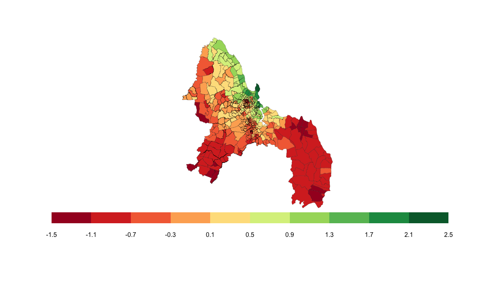

# Summary
Ground-truth figures for many UN sustainable development goal (SDG) indicators, such as the deprivation level, prevalence of Female Genital Mutilation, and accessibility of health care in areas in developing countries are often unreliable or unavailable.  Comparative judgment methods allow us to estimate these statistics by asking citizens of developing countries to compare different areas in their region based on the quality in question. In practice however, comparative judgment models require time-consuming and expensive fieldwork. `BSBT` offers a solution by providing both a GUI for data collection and an R package to analyse the data. [One or two sentences about the data collection software]. The R package allows the data to be analysed without technical knowledge, making this approach attractive to non-mathematical practitioners. The package implements a comparative judgment model with a spatial element, which makes efficient use of the use of the data collected and reduces the amount of data required compared to previous methods. 

# Statement of Need
Comparative judgement models, such the the Bradley--Terry (BT) model [@Brad52], are used to estimate the quality of objects in a set, for example chess players in a tournament [@Car12] or sports teams in a league [@Cat12]. In this software, the objects are areas of cities or countries, the qualities are statistics about each area, such as the deprivation level, and the users carrying out out the comparisons are refered to as judges. In the BT model each area in the study is assigned a quality $\lambda \in \mathbb{R}$, and the probability that, in a comparison between areas $i$ and $j$, area $i$ is judged to have a higher quality than $j$ depends on the difference in quality parameters. The `BradleyTerry2` R package [@Turner2012; @Firth12] provides a widely-used implementation of the BT model. However, in order to get good estimates for the qualities, a large amount of data needs to be collected. This makes carrying out comparative judgement studies in developing countries prohibitively expensive and logistically difficult [@Eng18; @Etten19; @Seymour20]. We address this in two ways: firstly, we provide an easy-to-use GUI to carry out the fieldwork, simplifying the task for both judges and researchers; secondly, we include a data analysis package that implements and extends the Bayesian Spatial Bradley--Terry (BSBT) model [@Seymour20], which reduces the number of comparisons required to provide good estimates compared to the `BradleyTerry2` package. 

In order to carry out a comparative judgement study, specialised software is required to show judges pairs of areas to compare and to manage the details of the users. [Bertrand's part about the data collection software]

The `BSBT` R package [@BSBT_CRAN] provides an implementation of the BSBT model. In this model, we assume the quality of the areas are correlated, with qualities of nearby areas having higher correlation than qualities of areas which are far apart. Including spatial correlation reduces the number of comparisons that need to be collected in order to provide good estimates of the qualities, as we can learn about the quality of one area from nearby areas. In order to make this applicable to as many contexts as possible, we provide two methods of defining nearby areas: the first is using a Euclidean distance metric, which is suitable for regions which contain areas of similar sizes, the second is a network distance metric, where each area is represented as a node and edges a placed between adjacent areas and this method is suitable for regions which contain areas of different sizes, such as cities where the centre is packed with small areas and the suburbs contain larger areas. The qualities of the areas and model hyperparameters are then estimated using a Markov chain Monte Carlo (MCMC) algorithm. We include an implementation of the BSBT model where there are two types of judges, e.g. male and female, which allows the differences between the different judges' perceptions to be analysed. We also include a asymmetric model for $n$ types of judges, where one type of judge is chosen to be baseline, and the difference between the perceptions of each type of judge and the baseline type is given. The package includes vignettes on how to use the package features and the BT model, alongside the documentation for the functions. 

# Relevant Research Projects
Included in the R package is a comparative judgement data set we collected in Tanzania, which contains over 75,000 comparisons of areas in Dar es Salaam, the largest city in Tanzania. Over 200 citizens were involved in the study and compared areas based on affluence. We collected the data using the GUI included in the software and developed the BSBT model to analyse the data. We were able to estimate the level of deprivation in each part of the city, and the levels are shown in figure \ref{fig:dar_map}. We also used the software to find areas women percieve as more deprived than me do. This may indicate areas where women are not provided with economic or social oppourtunities, or areas were women do not feel safe.  More information can be found in @Seymour20.

# Acknowledgements

This work is supported by the Engineering and Physical Sciences Research Council and the Big East African Data Science research group at the University of Nottingham.

# References
